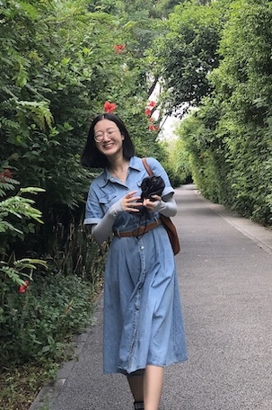

### Hi there 👋

I'm Ruxin Qu, I'm a Full Stack Coding Bootcamp student from University of Washington! I love drawing and playing with my dog🐶! I'm interested in pursuing a role in technology field!

<!-- - 🔭 I’m currently working on :  -->
<!-- - 👯 I’m looking to collaborate on ...
- 🤔 I’m looking for help with ... -->
<!-- - 💬 Ask me about ... -->
- 🌱 I’m currently learning Node.js 
- 📫 How to reach me: [linkdin](https://www.linkedin.com/in/ruxin-qu-94a034176/)
- 😄 Pronouns: roo-sheen
- ⚡ Fun fact: 

